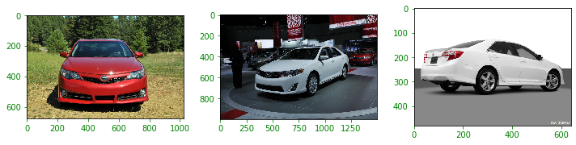

### This notebook trains a model to be used for detecting different types of cars.

Created by Sean Riordan, for my Truman State Capstone Experience.

# Setup

Obtain the roles used to access AWS tools.
Import the sagemaker image classification utility.


```python
import os
import urllib.request
import boto3, botocore

import sagemaker
from sagemaker import get_execution_role

import mxnet as mx
mxnet_path = mx.__file__[ : mx.__file__.rfind('/')]
print(mxnet_path)

role = get_execution_role()
print(role)

# Utilize AWS tools like S3 Buckets, and creating endpoints 
sess = sagemaker.Session()
```

    /home/ec2-user/anaconda3/envs/mxnet_p36/lib/python3.6/site-packages/mxnet
    arn:aws:iam::028684101672:role/service-role/AmazonSageMaker-ExecutionRole-20200707T192156


### S3 Bucket


Specifies the Bucket in which the images are stored.
DeepLens-compatible buckets must start with `deeplens`


```python
# Root folder where everything is stored.
BUCKET = 'deeplens-cardetect'

# Subfolder so as to not overwrite objects
PREFIX = 'deeplens-detection'
```


```python
from sagemaker.amazon.amazon_estimator import get_image_uri

# pulls the latest image classification algorithm. See https://docs.aws.amazon.com/sagemaker/latest/dg/image-classification.html
image_algo = get_image_uri(sess.boto_region_name, 'image-classification', repo_version="latest")

print (image_algo)
```

    'get_image_uri' method will be deprecated in favor of 'ImageURIProvider' class in SageMaker Python SDK v2.


    811284229777.dkr.ecr.us-east-1.amazonaws.com/image-classification:latest


Checks for bucket access permissions.


```python
#creating a text file and attempting to store in provided bucket

s3 = boto3.resource('s3')                  #S3 Bucket Object
access_data = 'checking access'            #Text file data
object = s3.Object(BUCKET, "test.txt")     #Text file object

try:
    object.put(Body=access_data)
except botocore.exceptions.ClientError as e:
    if e.response['Error']['Code'] == "AccessDenied":
        #cannot write on the bucket
        print("Bucket "+BUCKET+"is not writeable, check permissions")
    else:
        if e.response['Error']['Code'] == "NoSuchBucket":
            #Bucket does not exist
            print("Bucket"+BUCKET+" does not exist")
        else:
            raise
else:
    print("Bucket access is Ok")
    #object.delete(BUCKET, TEST)
```

    Bucket access is Ok


# Prepare data

The images in my s3 bucket are separated into different types of car classes which are designated by different folders. For example: 
```
|-deeplens-cardetect
   |-deeplens-detection

    |-images
    
        |-Audi S4 Sedan 2007 
    
        |-BMW M3 Coupe 2012 
    
        |-Ford GT Coupe 2006 
 ```


```python

```


```python
#!rm -rf data/ && mkdir -p data
#!mkdir -p data/images
#!unzip -qq car_imgs.zip -d data/images
```


```python
import matplotlib.pyplot as plt
%matplotlib inline

def show_images(item_name, images_to_show=-1):
    _im_list = !ls $IMAGES_DIR/$item_name

    NUM_COLS = 3
    if images_to_show == -1:
        IM_COUNT = len(_im_list)
    else:
        IM_COUNT = images_to_show
    
    print('Displaying images category ' + item_name + ' count: ' + str(IM_COUNT) + ' images.')
    
    NUM_ROWS = int(IM_COUNT / NUM_COLS)
    if ((IM_COUNT % NUM_COLS) > 0):
        NUM_ROWS += 1

    fig, axarr = plt.subplots(NUM_ROWS, NUM_COLS)
    fig.set_size_inches(10.0, 10.0, forward=True)

    curr_row = 0
    for curr_img in range(IM_COUNT):
        # fetch the url as a file type object, then read the image
        f = IMAGES_DIR + item_name + '/' + _im_list[curr_img]
        a = plt.imread(f)

        # find the column by taking the current index modulo 3
        col = curr_img % NUM_ROWS
        # plot on relevant subplot
        if NUM_ROWS == 1:
            axarr[curr_row].imshow(a)
        else:
            axarr[col, curr_row].imshow(a)
        if col == (NUM_ROWS - 1):
            # we have finished the current row, so increment row counter
            curr_row += 1

    fig.tight_layout()       
    plt.show()
        
    # Clean up
    plt.clf()
    plt.cla()
    plt.close()
```


```python
IMAGES_DIR = 'data/images/'
show_images("BMW-M3-Coupe-2012", images_to_show=3)
show_images("Ford-Fiesta-Sedan-2012", images_to_show=3)
show_images("Hummer-SUV", images_to_show=3)
show_images("Lamborghini-Aventador-Coupe-2012", images_to_show=3)
show_images("Toyota-Camry-Sedan-2012", images_to_show=3)
```

    Displaying images category BMW-M3-Coupe-2012 count: 3 images.


    Displaying images category Ford-Fiesta-Sedan-2012 count: 3 images.


    Displaying images category Hummer-SUV count: 3 images.


    Displaying images category Lamborghini-Aventador-Coupe-2012 count: 3 images.


    Displaying images category Toyota-Camry-Sedan-2012 count: 3 images.





```python
DEST_BUCKET = 's3://'+BUCKET+'/'+PREFIX+'/images/'
```


```python
!aws s3 cp --recursive data/images $DEST_BUCKET --quiet
```

#### Prepare "list" files with train-val split

The image classification algorithm can take two types of input formats. The first is a [RecordIO format](https://mxnet.apache.org/api/faq/recordio) (content type: application/x-recordio) and the other is a Image list format (.lst file). These file formats allows for efficient loading of images when training the model. In this example we will be using the Image list format (.lst file). A .lst file is a tab-separated file with three columns that contains a list of image files. The first column specifies the image index, the second column specifies the class label index for the image, and the third column specifies the relative path of the image file. The RecordIO file contains the actual pixel data for the images.

To be able to create the .rec files, we first need to split the data into training and validation sets (after shuffling) and create two list files for each. Here our split into train, validation and test (specified by the `0.7` parameter below for test). We keep 0.02% to test the model.

The image and lst files will be converted to RecordIO file internally by the image classification algorithm. But if you want do the conversion, the following cell shows how to do it using the [im2rec](https://github.com/apache/incubator-mxnet/blob/master/tools/im2rec.py) tool. Note that this is just an example of creating RecordIO files. We are **_not_** using them for training in this notebook.


```python
!python $mxnet_path/tools/im2rec.py --list --recursive --test-ratio=0.02 --train-ratio 0.7 cars data/images
```

    BMW-M3-Coupe-2012 0
    Ford-ESeries-Wagon-Van-2012 1
    Ford-Expedition-EL-SUV-2009 2
    Ford-Fiesta-Sedan-2012 3
    Ford-Freestar-Minivan-2007 4
    Hummer-SUV 5
    Lamborghini-Aventador-Coupe-2012 6
    Toyota-Camry-Sedan-2012 7
    Toyota-Corolla-Sedan-2012 8
    Volvo-240-Sedan-1993 9


## Save lst files to S3
Training models is easy with Amazon SageMaker. When you’re ready to train in SageMaker, simply specify the location of your data in Amazon S3, and indicate the type and quantity of SageMaker ML instances you need. SageMaker sets up a distributed compute cluster, performs the training, outputs the result to Amazon S3, and tears down the cluster when complete. 
To use Amazon Sagemaker training we must first transfer our input data to Amazon S3.


```python
s3train_lst = 's3://{}/{}/train_lst/'.format(BUCKET, PREFIX)
s3validation_lst = 's3://{}/{}/validation_lst/'.format(BUCKET, PREFIX)

# upload the lst files to train_lst and validation_lst channels
!aws s3 cp cars_train.lst $s3train_lst --quiet
!aws s3 cp cars_val.lst $s3validation_lst --quiet
```

#### Retrieve dataset size

Let's see the size of train, validation and test datasets


```python
f = open('cars_train.lst', 'r')
train_samples = sum(1 for line in f)
f.close()
f = open('cars_val.lst', 'r')
val_samples = sum(1 for line in f)
f.close()
f = open('cars_test.lst', 'r')
test_samples = sum(1 for line in f)
f.close()
print('train_samples:', train_samples)
print('val_samples:', val_samples)
print('test_samples:', test_samples)
```

    train_samples: 606
    val_samples: 244
    test_samples: 17


This marks the end of the data preparation phase.

# Train the model

Training a good model from scratch can take a long time. Fortunately, we're able to use transfer learning to fine-tune a model that has been trained on millions of images. Transfer learning allows us to train a model to recognize new classes in minutes instead of hours or days that it would normally take to train the model from scratch. Transfer learning requires a lot less data to train a model than from scratch (hundreds instead of tens of thousands).

## Fine-tuning the Image Classification Model
Now that we are done with all the setup that is needed, we are ready to train our trash detector. To begin, let us create a ``sageMaker.estimator.Estimator`` object. This estimator will launch the training job.
### Training parameters
There are two kinds of parameters that need to be set for training. The first one are the parameters for the training job. These include:

* **Training instance count**: This is the number of instances on which to run the training. When the number of instances is greater than one, then the image classification algorithm will run in distributed settings. 
* **Training instance type**: This indicates the type of machine on which to run the training. Typically, we use GPU instances for these training 
* **Output path**: This the s3 folder in which the training output is stored


```python
s3_output_location = 's3://{}/{}/output'.format(BUCKET, PREFIX)
ic = sagemaker.estimator.Estimator(image_algo,
                                         role, 
                                         train_instance_count=1, 
                                         train_instance_type='ml.p2.xlarge',
                                         train_volume_size = 50,
                                         train_max_run = 360000,
                                         input_mode= 'File',
                                         output_path=s3_output_location,
                                         sagemaker_session=sess,
                                         base_job_name='ic-cars')
```

    WARNING:root:Parameter image_name will be renamed to image_uri in SageMaker Python SDK v2.


Apart from the above set of parameters, there are hyperparameters that are specific to the algorithm. These are:

* **num_layers**: The number of layers (depth) for the network. We use 18 in this samples but other values such as 50, 152 can be used.
* **use_pretrained_model**: Set to 1 to use pretrained model for transfer learning.
* **image_shape**: The input image dimensions,'num_channels, height, width', for the network. It should be no larger than the actual image size. The number of channels should be same as the actual image.
* **num_classes**: This is the number of output classes for the new dataset. For us, we have 
* **num_training_samples**: This is the total number of training samples. It is set to 15240 for caltech dataset with the current split.
* **mini_batch_size**: The number of training samples used for each mini batch. In distributed training, the number of training samples used per batch will be N * mini_batch_size where N is the number of hosts on which training is run.
* **epochs**: Number of training epochs.
* **learning_rate**: Learning rate for training.
* **top_k**: Report the top-k accuracy during training.
* **resize**: Resize the image before using it for training. The images are resized so that the shortest side is of this parameter. If the parameter is not set, then the training data is used as such without resizing.
* **precision_dtype**: Training datatype precision (default: float32). If set to 'float16', the training will be done in mixed_precision mode and will be faster than float32 mode


```python
ic.set_hyperparameters(num_layers=18,
                             use_pretrained_model=1,
                             image_shape = "3,224,224",
                             num_classes=10,
                             mini_batch_size=128,
                             epochs=10,
                             learning_rate=0.01,
                             top_k=2,
                             num_training_samples=train_samples,
                             resize = 224,
                             precision_dtype='float32')
```

## Input data specification
Set the data type and channels used for training


```python
s3images = 's3://{}/{}/images/'.format(BUCKET, PREFIX)

train_data = sagemaker.session.s3_input(s3images, distribution='FullyReplicated', 
                        content_type='application/x-image', s3_data_type='S3Prefix')
validation_data = sagemaker.session.s3_input(s3images, distribution='FullyReplicated', 
                             content_type='application/x-image', s3_data_type='S3Prefix')
train_data_lst = sagemaker.session.s3_input(s3train_lst, distribution='FullyReplicated', 
                        content_type='application/x-image', s3_data_type='S3Prefix')
validation_data_lst = sagemaker.session.s3_input(s3validation_lst, distribution='FullyReplicated', 
                             content_type='application/x-image', s3_data_type='S3Prefix')

data_channels = {'train': train_data, 'validation': validation_data, 
                 'train_lst': train_data_lst, 'validation_lst': validation_data_lst}
```

    WARNING:sagemaker:'s3_input' class will be renamed to 'TrainingInput' in SageMaker Python SDK v2.
    WARNING:sagemaker:'s3_input' class will be renamed to 'TrainingInput' in SageMaker Python SDK v2.
    WARNING:sagemaker:'s3_input' class will be renamed to 'TrainingInput' in SageMaker Python SDK v2.
    WARNING:sagemaker:'s3_input' class will be renamed to 'TrainingInput' in SageMaker Python SDK v2.


## Start the training
Start training by calling the fit method in the estimator


```python
ic.fit(inputs=data_channels, logs=True)
```

    2020-07-14 22:15:18 Starting - Starting the training job...
    2020-07-14 22:15:20 Starting - Launching requested ML instances.........
    2020-07-14 22:17:05 Starting - Preparing the instances for training.........
    2020-07-14 22:18:37 Downloading - Downloading input data......
    2020-07-14 22:19:27 Training - Downloading the training image...
    2020-07-14 22:20:14 Training - Training image download completed. Training in progress..Docker entrypoint called with argument(s): train
    [07/14/2020 22:20:18 INFO 140558353856320] Reading default configuration from /opt/amazon/lib/python2.7/site-packages/image_classification/default-input.json: {u'beta_1': 0.9, u'gamma': 0.9, u'beta_2': 0.999, u'optimizer': u'sgd', u'use_pretrained_model': 0, u'eps': 1e-08, u'epochs': 30, u'lr_scheduler_factor': 0.1, u'num_layers': 152, u'image_shape': u'3,224,224', u'precision_dtype': u'float32', u'mini_batch_size': 32, u'weight_decay': 0.0001, u'learning_rate': 0.1, u'momentum': 0}
    [07/14/2020 22:20:18 INFO 140558353856320] Merging with provided configuration from /opt/ml/input/config/hyperparameters.json: {u'learning_rate': u'0.01', u'top_k': u'2', u'use_pretrained_model': u'1', u'epochs': u'10', u'num_training_samples': u'606', u'num_layers': u'18', u'num_classes': u'10', u'mini_batch_size': u'128', u'precision_dtype': u'float32', u'resize': u'224', u'image_shape': u'3,224,224'}
    [07/14/2020 22:20:18 INFO 140558353856320] Final configuration: {u'top_k': u'2', u'optimizer': u'sgd', u'learning_rate': u'0.01', u'epochs': u'10', u'resize': u'224', u'lr_scheduler_factor': 0.1, u'num_layers': u'18', u'precision_dtype': u'float32', u'mini_batch_size': u'128', u'num_classes': u'10', u'beta_1': 0.9, u'beta_2': 0.999, u'use_pretrained_model': u'1', u'eps': 1e-08, u'weight_decay': 0.0001, u'momentum': 0, u'image_shape': u'3,224,224', u'gamma': 0.9, u'num_training_samples': u'606'}
    [07/14/2020 22:20:18 INFO 140558353856320] Searching for .lst files in /opt/ml/input/data/train_lst.
    [07/14/2020 22:20:18 INFO 140558353856320] Creating record files for cars_train.lst
    [07/14/2020 22:20:21 INFO 140558353856320] Done creating record files...
    [07/14/2020 22:20:21 INFO 140558353856320] Searching for .lst files in /opt/ml/input/data/validation_lst.
    [07/14/2020 22:20:21 INFO 140558353856320] Creating record files for cars_val.lst
    [07/14/2020 22:20:22 INFO 140558353856320] Done creating record files...
    [07/14/2020 22:20:22 INFO 140558353856320] use_pretrained_model: 1
    [07/14/2020 22:20:22 INFO 140558353856320] multi_label: 0
    [07/14/2020 22:20:22 INFO 140558353856320] Using pretrained model for initializing weights and transfer learning.
    [07/14/2020 22:20:22 INFO 140558353856320] ---- Parameters ----
    [07/14/2020 22:20:22 INFO 140558353856320] num_layers: 18
    [07/14/2020 22:20:22 INFO 140558353856320] data type: <type 'numpy.float32'>
    [07/14/2020 22:20:22 INFO 140558353856320] epochs: 10
    [07/14/2020 22:20:22 INFO 140558353856320] image resize size: 224
    [07/14/2020 22:20:22 INFO 140558353856320] optimizer: sgd
    [07/14/2020 22:20:22 INFO 140558353856320] momentum: 0.9
    [07/14/2020 22:20:22 INFO 140558353856320] weight_decay: 0.0001
    [07/14/2020 22:20:22 INFO 140558353856320] learning_rate: 0.01
    [07/14/2020 22:20:22 INFO 140558353856320] num_training_samples: 606
    [07/14/2020 22:20:22 INFO 140558353856320] mini_batch_size: 128
    [07/14/2020 22:20:22 INFO 140558353856320] image_shape: 3,224,224
    [07/14/2020 22:20:22 INFO 140558353856320] num_classes: 10
    [07/14/2020 22:20:22 INFO 140558353856320] augmentation_type: None
    [07/14/2020 22:20:22 INFO 140558353856320] kv_store: device
    [07/14/2020 22:20:22 INFO 140558353856320] top_k: 2
    [07/14/2020 22:20:22 INFO 140558353856320] checkpoint_frequency not set, will store the best model
    [07/14/2020 22:20:22 INFO 140558353856320] --------------------
    [22:20:22] /opt/brazil-pkg-cache/packages/AIAlgorithmsMXNet/AIAlgorithmsMXNet-1.3.x_ecl_Cuda_10.1.x.2633.0/AL2012/generic-flavor/src/src/nnvm/legacy_json_util.cc:209: Loading symbol saved by previous version v0.8.0. Attempting to upgrade...
    [22:20:22] /opt/brazil-pkg-cache/packages/AIAlgorithmsMXNet/AIAlgorithmsMXNet-1.3.x_ecl_Cuda_10.1.x.2633.0/AL2012/generic-flavor/src/src/nnvm/legacy_json_util.cc:217: Symbol successfully upgraded!
    [07/14/2020 22:20:23 INFO 140558353856320] Setting number of threads: 3
    [22:20:34] /opt/brazil-pkg-cache/packages/AIAlgorithmsMXNet/AIAlgorithmsMXNet-1.3.x_ecl_Cuda_10.1.x.2633.0/AL2012/generic-flavor/src/src/operator/nn/./cudnn/./cudnn_algoreg-inl.h:97: Running performance tests to find the best convolution algorithm, this can take a while... (setting env variable MXNET_CUDNN_AUTOTUNE_DEFAULT to 0 to disable)
    [07/14/2020 22:20:42 INFO 140558353856320] Epoch[0] Train-accuracy=0.150391
    [07/14/2020 22:20:42 INFO 140558353856320] Epoch[0] Train-top_k_accuracy_2=0.273438
    [07/14/2020 22:20:42 INFO 140558353856320] Epoch[0] Time cost=8.095
    [07/14/2020 22:20:43 INFO 140558353856320] Epoch[0] Validation-accuracy=0.253906
    [07/14/2020 22:20:43 INFO 140558353856320] Storing the best model with validation accuracy: 0.253906
    [07/14/2020 22:20:44 INFO 140558353856320] Saved checkpoint to "/opt/ml/model/image-classification-0001.params"
    [07/14/2020 22:20:46 INFO 140558353856320] Epoch[1] Train-accuracy=0.642578
    [07/14/2020 22:20:46 INFO 140558353856320] Epoch[1] Train-top_k_accuracy_2=0.808594
    [07/14/2020 22:20:46 INFO 140558353856320] Epoch[1] Time cost=2.620
    [07/14/2020 22:20:47 INFO 140558353856320] Epoch[1] Validation-accuracy=0.554688
    [07/14/2020 22:20:47 INFO 140558353856320] Storing the best model with validation accuracy: 0.554688
    [07/14/2020 22:20:47 INFO 140558353856320] Saved checkpoint to "/opt/ml/model/image-classification-0002.params"
    [07/14/2020 22:20:50 INFO 140558353856320] Epoch[2] Train-accuracy=0.919922
    [07/14/2020 22:20:50 INFO 140558353856320] Epoch[2] Train-top_k_accuracy_2=0.966797
    [07/14/2020 22:20:50 INFO 140558353856320] Epoch[2] Time cost=2.575
    [07/14/2020 22:20:51 INFO 140558353856320] Epoch[2] Validation-accuracy=0.621094
    [07/14/2020 22:20:51 INFO 140558353856320] Storing the best model with validation accuracy: 0.621094
    [07/14/2020 22:20:51 INFO 140558353856320] Saved checkpoint to "/opt/ml/model/image-classification-0003.params"
    [07/14/2020 22:20:54 INFO 140558353856320] Epoch[3] Train-accuracy=0.964844
    [07/14/2020 22:20:54 INFO 140558353856320] Epoch[3] Train-top_k_accuracy_2=0.988281
    [07/14/2020 22:20:54 INFO 140558353856320] Epoch[3] Time cost=2.573
    [07/14/2020 22:20:55 INFO 140558353856320] Epoch[3] Validation-accuracy=0.734375
    [07/14/2020 22:20:55 INFO 140558353856320] Storing the best model with validation accuracy: 0.734375
    [07/14/2020 22:20:55 INFO 140558353856320] Saved checkpoint to "/opt/ml/model/image-classification-0004.params"
    [07/14/2020 22:20:58 INFO 140558353856320] Epoch[4] Train-accuracy=0.994141
    [07/14/2020 22:20:58 INFO 140558353856320] Epoch[4] Train-top_k_accuracy_2=0.998047
    [07/14/2020 22:20:58 INFO 140558353856320] Epoch[4] Time cost=2.577
    [07/14/2020 22:20:59 INFO 140558353856320] Epoch[4] Validation-accuracy=0.765625
    [07/14/2020 22:20:59 INFO 140558353856320] Storing the best model with validation accuracy: 0.765625
    [07/14/2020 22:20:59 INFO 140558353856320] Saved checkpoint to "/opt/ml/model/image-classification-0005.params"
    [07/14/2020 22:21:02 INFO 140558353856320] Epoch[5] Train-accuracy=0.998047
    [07/14/2020 22:21:02 INFO 140558353856320] Epoch[5] Train-top_k_accuracy_2=1.000000
    [07/14/2020 22:21:02 INFO 140558353856320] Epoch[5] Time cost=2.591
    [07/14/2020 22:21:03 INFO 140558353856320] Epoch[5] Validation-accuracy=0.816406
    [07/14/2020 22:21:03 INFO 140558353856320] Storing the best model with validation accuracy: 0.816406
    [07/14/2020 22:21:03 INFO 140558353856320] Saved checkpoint to "/opt/ml/model/image-classification-0006.params"
    [07/14/2020 22:21:05 INFO 140558353856320] Epoch[6] Train-accuracy=1.000000
    [07/14/2020 22:21:05 INFO 140558353856320] Epoch[6] Train-top_k_accuracy_2=1.000000
    [07/14/2020 22:21:05 INFO 140558353856320] Epoch[6] Time cost=2.583
    [07/14/2020 22:21:06 INFO 140558353856320] Epoch[6] Validation-accuracy=0.832031
    [07/14/2020 22:21:06 INFO 140558353856320] Storing the best model with validation accuracy: 0.832031
    [07/14/2020 22:21:07 INFO 140558353856320] Saved checkpoint to "/opt/ml/model/image-classification-0007.params"
    
    2020-07-14 22:21:21 Uploading - Uploading generated training model[07/14/2020 22:21:09 INFO 140558353856320] Epoch[7] Train-accuracy=1.000000
    [07/14/2020 22:21:09 INFO 140558353856320] Epoch[7] Train-top_k_accuracy_2=1.000000
    [07/14/2020 22:21:09 INFO 140558353856320] Epoch[7] Time cost=2.581
    [07/14/2020 22:21:10 INFO 140558353856320] Epoch[7] Validation-accuracy=0.832031
    [07/14/2020 22:21:13 INFO 140558353856320] Epoch[8] Train-accuracy=1.000000
    [07/14/2020 22:21:13 INFO 140558353856320] Epoch[8] Train-top_k_accuracy_2=1.000000
    [07/14/2020 22:21:13 INFO 140558353856320] Epoch[8] Time cost=2.577
    [07/14/2020 22:21:14 INFO 140558353856320] Epoch[8] Validation-accuracy=0.835938
    [07/14/2020 22:21:14 INFO 140558353856320] Storing the best model with validation accuracy: 0.835938
    [07/14/2020 22:21:14 INFO 140558353856320] Saved checkpoint to "/opt/ml/model/image-classification-0009.params"
    [07/14/2020 22:21:17 INFO 140558353856320] Epoch[9] Train-accuracy=1.000000
    [07/14/2020 22:21:17 INFO 140558353856320] Epoch[9] Train-top_k_accuracy_2=1.000000
    [07/14/2020 22:21:17 INFO 140558353856320] Epoch[9] Time cost=2.596
    [07/14/2020 22:21:18 INFO 140558353856320] Epoch[9] Validation-accuracy=0.882812
    [07/14/2020 22:21:18 INFO 140558353856320] Storing the best model with validation accuracy: 0.882812
    [07/14/2020 22:21:18 INFO 140558353856320] Saved checkpoint to "/opt/ml/model/image-classification-0010.params"
    
    2020-07-14 22:21:32 Completed - Training job completed
    Training seconds: 175
    Billable seconds: 175


#### The output from the above command will have the model accuracy and the time it took to run the training. 
#### You can also view these details by navigating to ``Training -> Training Jobs -> job_name -> View logs`` in the Amazon SageMaker console 

The model trained above can now be found in the `s3://<YOUR_BUCKET>/<PREFIX>/output` path.


```python
MODEL_PATH = ic.model_data
print(MODEL_PATH)
```

    s3://deeplens-cardetect/deeplens-detection/output/ic-cars-2020-07-14-22-15-18-034/output/model.tar.gz


## Deploy to a Sagemaker endpoint
After training your model is complete, you can test your model by asking it to predict the class of a sample trash image that the model has not seen before. This step is called inference.

Amazon SageMaker provides an HTTPS endpoint where your machine learning model is available to provide inferences. For more information see the [Amazon SageMaker documentation](https://docs.aws.amazon.com/sagemaker/latest/dg/how-it-works-hosting.html).


```python
ic_infer = ic.deploy(initial_instance_count=1, instance_type='ml.p2.xlarge')
```

    WARNING:sagemaker:Parameter image will be renamed to image_uri in SageMaker Python SDK v2.


    -----------------!

## Test the images against the endpoint
We will use the test images that were kept aside for testing.


```python
object_categories = [
    "BMW-M3-Coupe-2012",
    "Ford-ESeries-Wagon-Van-2012",
    "Ford-Expedition-EL-SUV-2009",
    "Ford-Fiesta-Sedan-2012",
    "Ford-Freestar-Minivan-2007",
    "Hummer-SUV",
    "Lamborghini-Aventador-Coupe-2012",
    "Toyota-Camry-Sedan-2012",
    "Toyota-Corolla-Sedan-2012",
    "Volvo-240-Sedan-1993"]
```


```python
from IPython.display import Image, display
import json
import numpy as np


def test_model():
    preds = []
    acts  = []
    num_errors = 0
    with open('cars_test.lst', 'r') as f:
        for line in f:
            stripped_line = str(line.strip()).split("\t")
            file_path = stripped_line[2]
            category = int(float(stripped_line[1]))
            with open(IMAGES_DIR + stripped_line[2], 'rb') as f:
                payload = f.read()
                payload = bytearray(payload)

                ic_infer.content_type = 'application/x-image'
                result = json.loads(ic_infer.predict(payload))
            # the result will output the probabilities for all classes
            # find the class with maximum probability and print the class index
            index = np.argmax(result)
            act = object_categories[category]
            pred = object_categories[index]
            conf = result[index]
            print("Result: Predicted: {}, Confidence: {:.2f}, Actual: {} ".format(pred, conf, act))
            acts.append(category)
            preds.append(index)
            if (pred != act):
                num_errors += 1
                print('ERROR on image -- Predicted: {}, Confidence: {:.2f}, Actual: {}'.format(pred, conf, act))
            display(Image(filename=IMAGES_DIR + stripped_line[2], width=100, height=100))

    return num_errors, preds, acts
num_errors, preds, acts = test_model()
```

    Result: Predicted: BMW-M3-Coupe-2012, Confidence: 0.97, Actual: BMW-M3-Coupe-2012 


    Result: Predicted: Volvo-240-Sedan-1993, Confidence: 0.59, Actual: Ford-Freestar-Minivan-2007 
    ERROR on image -- Predicted: Volvo-240-Sedan-1993, Confidence: 0.59, Actual: Ford-Freestar-Minivan-2007


    Result: Predicted: Ford-Freestar-Minivan-2007, Confidence: 1.00, Actual: Ford-Freestar-Minivan-2007 


    Result: Predicted: Ford-Fiesta-Sedan-2012, Confidence: 0.70, Actual: Ford-Fiesta-Sedan-2012 


    Result: Predicted: Hummer-SUV, Confidence: 0.98, Actual: Hummer-SUV 


    Result: Predicted: Ford-ESeries-Wagon-Van-2012, Confidence: 0.98, Actual: Ford-ESeries-Wagon-Van-2012 


    Result: Predicted: Lamborghini-Aventador-Coupe-2012, Confidence: 0.52, Actual: Lamborghini-Aventador-Coupe-2012 


    Result: Predicted: BMW-M3-Coupe-2012, Confidence: 0.75, Actual: BMW-M3-Coupe-2012 


    Result: Predicted: Volvo-240-Sedan-1993, Confidence: 1.00, Actual: Volvo-240-Sedan-1993 


    Result: Predicted: Hummer-SUV, Confidence: 1.00, Actual: Hummer-SUV 


    Result: Predicted: Ford-Fiesta-Sedan-2012, Confidence: 0.85, Actual: Lamborghini-Aventador-Coupe-2012 
    ERROR on image -- Predicted: Ford-Fiesta-Sedan-2012, Confidence: 0.85, Actual: Lamborghini-Aventador-Coupe-2012


    Result: Predicted: BMW-M3-Coupe-2012, Confidence: 0.61, Actual: BMW-M3-Coupe-2012 


    Result: Predicted: Ford-ESeries-Wagon-Van-2012, Confidence: 0.92, Actual: Ford-ESeries-Wagon-Van-2012 


    Result: Predicted: Ford-Freestar-Minivan-2007, Confidence: 0.91, Actual: Ford-Freestar-Minivan-2007 


    Result: Predicted: Ford-Fiesta-Sedan-2012, Confidence: 0.86, Actual: Ford-Fiesta-Sedan-2012 


    Result: Predicted: BMW-M3-Coupe-2012, Confidence: 0.69, Actual: BMW-M3-Coupe-2012 


    Result: Predicted: Hummer-SUV, Confidence: 1.00, Actual: Hummer-SUV 


```python
from sklearn.metrics import confusion_matrix
import numpy as np
import itertools
COLOR = 'green'
plt.rcParams['text.color'] = COLOR
plt.rcParams['axes.labelcolor'] = COLOR
plt.rcParams['xtick.color'] = COLOR
plt.rcParams['ytick.color'] = COLOR
def plot_confusion_matrix(cm, classes,
                          class_name_list,
                          normalize=False,
                          title='Confusion matrix',
                          cmap=plt.cm.GnBu):
    plt.figure(figsize=(7,7))
    plt.grid(False)

    plt.imshow(cm, interpolation='nearest', cmap=cmap)
    plt.title(title)
    tick_marks = np.arange(len(classes))
    plt.xticks(tick_marks, classes, rotation=45)
    plt.yticks(tick_marks, classes)
    fmt = '.2f' if normalize else 'd'
    thresh = cm.max() / 2.
    for i, j in itertools.product(range(cm.shape[0]), 
                                  range(cm.shape[1])):
        plt.text(j, i, format(cm[i, j], fmt),
                 horizontalalignment="center",
                 color="white" if cm[i, j] > thresh else "black")
    plt.tight_layout()
    plt.gca().set_xticklabels(class_name_list)
    plt.gca().set_yticklabels(class_name_list)
    plt.ylabel('True label')
    plt.xlabel('Predicted label')

def create_and_plot_confusion_matrix(actual, predicted):
    cnf_matrix = confusion_matrix(actual, np.asarray(predicted),labels=range(len(object_categories)))
    plot_confusion_matrix(cnf_matrix, classes=range(len(object_categories)), class_name_list=object_categories)
```

## Display confusion matrix showing 'true' and 'predicted' labels

A confusion matrix is a table that is often used to describe the performance of a classification model (or "classifier") on a set of test data for which the true values are known. It's a table  with two dimensions ("actual" and "predicted"), and identical sets of "classes" in both dimensions (each combination of dimension and class is a variable in the contingency table). The diagonal values in the table indicate a match between the predicted class and the actual class. 

For more details go to [Confusion matrix](https://en.wikipedia.org/wiki/Confusion_matrix) (Wikipedia)


```python
create_and_plot_confusion_matrix(acts, preds)
```


## Approximate costs

As of 03/11/2020 and based on the pricing information displayed on the page: https://aws.amazon.com/sagemaker/pricing/, here's the costs you can expect in a 24 hour period:

 - Notebook instance cost **\\$6** Assuming you choose ml.t3.xlarge (\\$0.233/hour) instance. This can vary based on the size of instance you choose.
 - Training costs **\\$1.05** : Assuming you will run about 10 training runs in a 24 hour period using the sample dataset provided. The notebook uses a p2.xlarge (\\$1.26/hour) instance
 - Model hosting **\\$6.72** : Assuming you use the ml.m4.xlarge (\\$0.28/hour) instance running for 24 hours. 
 
*NOTE* : To save on costs, stop your notebook instances and delete the model edpoint when not in use

## (Optional) Clean-up

If you're ready to be done with this notebook, please run the cell below. This will remove the hosted endpoint you created and avoid any charges from a stray instance being left on.


```python
sess.delete_endpoint(ic_infer.endpoint)
print("Completed")
```

    Completed


## Rename model to deploy to AWS DeepLens
The MxNet model that is stored in the S3 bucket contains 2 files: the params file and a symbol.json file. To simplify deployment to AWS DeepLens, we'll modify the params file so that you do not need to specify the number of epochs the model was trained for.


```python
import glob
```


```python
!rm -rf data/$PREFIX/tmp && mkdir -p data/$PREFIX/tmp
!aws s3 cp $MODEL_PATH data/$PREFIX/tmp
!tar -xzvf data/$PREFIX/tmp/model.tar.gz -C data/$PREFIX/tmp
```

    download: s3://deeplens-cardetect/deeplens-detection/output/ic-cars-2020-07-14-22-15-18-034/output/model.tar.gz to data/deeplens-detection/tmp/model.tar.gz
    image-classification-0010.params
    model-shapes.json
    image-classification-symbol.json


```python
params_file_name = glob.glob('./data/' + PREFIX + '/tmp/*.params')[0]
```


```python
!mv $params_file_name data/$PREFIX/tmp/image-classification-0000.params
```


```python
!tar -cvzf ./model.tar.gz -C data/$PREFIX/tmp ./image-classification-0000.params ./image-classification-symbol.json
```

    ./image-classification-0000.params
    ./image-classification-symbol.json


```python
!aws s3 cp model.tar.gz $MODEL_PATH
```

    upload: ./model.tar.gz to s3://deeplens-cardetect/deeplens-detection/output/ic-cars-2020-07-14-22-15-18-034/output/model.tar.gz


## Next steps

At this point, you have completed:
* Training a model with Amazon Sagemaker using transfer learning

Next you'll deploy this model to AWS DeepLens. If you have started this notebook as part of a tutorial, please go back to the next step in the tutorial. If you have found this notebook through other channels, please go to [awsdeeplens.recipes](http://awsdeeplens.recipes) and select the Trash Detector tutorial to continue.


```python

```
